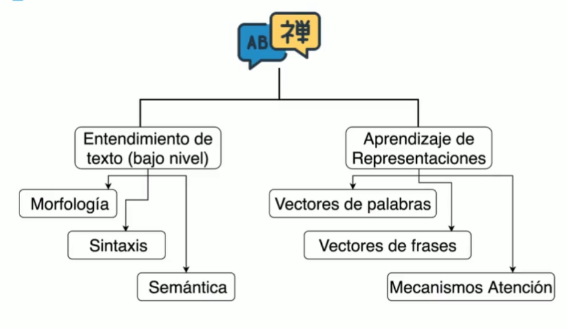

## Conceptos clave {font-size=12pt}

. . .

* **NLP**: Procesamiento del lenguaje natural (_Natural Language Processing_) \
    Se refiere a la capacidad de las máquinas de poder procesar palabras o elementos del lenguaje natural.

. . .

* **NLU**: Entendimiento del lenguaje natural (_Natural Language Understanding_) \
    Se refiere a un subárea del _NLP_ que se enfoca en que las máquinas puedan procesar el lenguaje natural.

## Usos del procesamiento del lenguaje natural

. . .

* **Máquinas de búsqueda**
* **Algoritmos de traducción del texto**
* **_Chatbots_**
* **Análisis de discursos**
* **Reconocimiento del habla**

## Evolución del NLP

::: {.incremental}

* [1950 - 1990] Sistemas basados en reglas

* [1990 - 2000] Estadísticas de corpus

* [2000 - 2014] _Machine Learning_

* [2014 - Actualidad] _Deep Learning_

:::

## Avances del NLP

