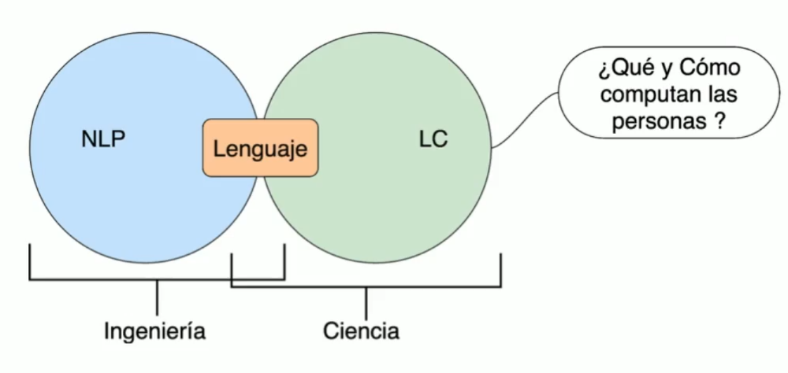
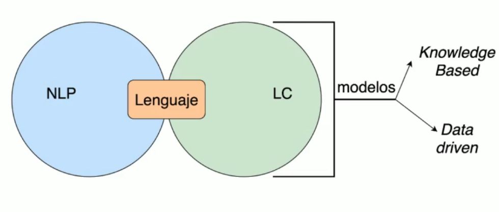
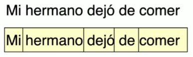
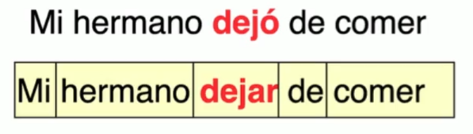

## NLP y LC

Ambas áreas tienen el lenguaje como objeto de estudio.

## NLP y LC

Sin embargo el **NLP** tiene un enfoque más práctico. Mientras que el **LC** se enfoca en el aspecto científico del lenguaje y de qué forma se pueden implementar en máquinas.

<!-- ## NLP (_Natural Language Processing_)

## LC (_Language Computational_) -->

## Tokenización

Consiste en dividir frases en unidades mínimas del lenguaje, en este caso, palabras.

{height=100%}

## Lematización

Es convertir cada uno de los tokens de un frase en sus unidades originales, por ejemplo un verbo se representaría en su raíz en lugar de su forma conjugada.

{height=100%}

## Segmentación

Se refiere a la división de un gran texto en unidades que posean significado por si mismo, es decir, en oraciones o frases.

